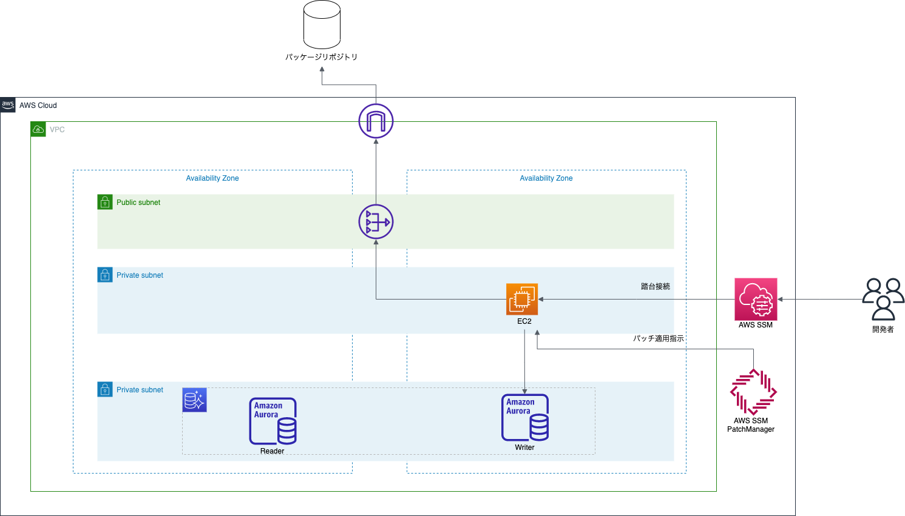
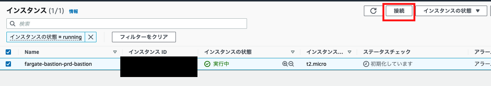
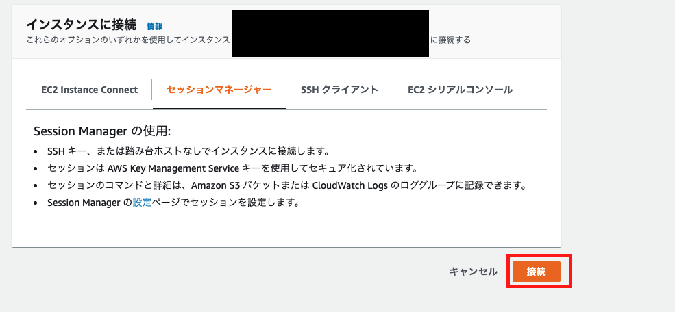
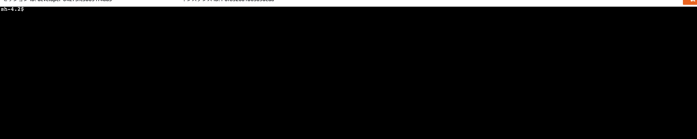

# FargateによるBastion(踏み台ホスト)の構築

## 　構成

踏み台を構成するにあたり、以下2パターンを検討。

今回は構成2をTerraformで実装します。(構成1は別リポジトリで実装)

### 構成1

別リポジトリで実装。

Fargateタスクを利用する、できればこちらを使いたいパターン。

https://github.com/bun913/aws_fargate_bastion

### 構成2

今回活用するパターン

EC2インスタンスを作成して、キーペアはあらかじめ作成しておく。



この構成のメリット

- SSM SessionManagerでsshポートを開けずに、プライベートサブネットのEC2にセキュアに接続できる
- SessionManagerでSSHセッションを開始できるので、SSHトンネリングでDBクライアント経由でRDSにアクセスしたい場合にも簡単
  - FargateのBastionではこちらが面倒

この構成のデメリット

- EC2を立てるので、Fargateに比べたら管理する範囲が広くなる
  - OSもシステム管理者側で管理しないといけなくなる・・
  - PatchManagerで最低限の脆弱性の自動更新は入れているが

DBクライアントを使う必要がない場合などは、素直に構成1を使った方が良さそう。

【参考】

https://docs.aws.amazon.com/ja_jp/systems-manager/latest/userguide/session-manager-getting-started-enable-ssh-connections.html

## 手順

### 事前準備

### productionリソース群の作成

今回は本番環境を想定して、productionというディレクトリ名にしている。
（他、developmentやstagingなど環境ごとに作成されるイメージ)


```bash
cd infra/production
terraform init
terraform plan
terraform apply
```

## 踏み台への接続確認

### AWSマネジメントコンソールからの確認

AWSマネジメントコンソールにログイン

EC2のサービスへ移動する

今回作成したインスタンスを選択し、右上の「接続」を押下



「セッションマネージャー」のタグを選び、右下の「接続」を押下



以下のようにシェルが表示されれば確認OK




### ローカルPCから確認


あらかじめ接続元のローカルPCにSessionManagerプラグインのインストールが必要であるため、公式の手順に沿ってインストール

https://docs.aws.amazon.com/ja_jp/systems-manager/latest/userguide/session-manager-working-with-install-plugin.html


次に公式の手順に沿って、 ~/.ssh/configを書き換える

```
# SSH over Session Manager
host i-* mi-*
    ProxyCommand sh -c "aws ssm start-session --target %h --document-name AWS-StartSSHSession --parameters 'portNumber=%p'"
```

https://docs.aws.amazon.com/ja_jp/systems-manager/latest/userguide/session-manager-getting-started-enable-ssh-connections.html

最後に sshコマンドで接続を確認

```bash
ssh ec2-user@インスタンスID -i 鍵へのパス
```

以下のようにログインできればOK

```

       __|  __|_  )
       _|  (     /   Amazon Linux 2 AMI
      ___|\___|___|

https://aws.amazon.com/amazon-linux-2/
$
```

